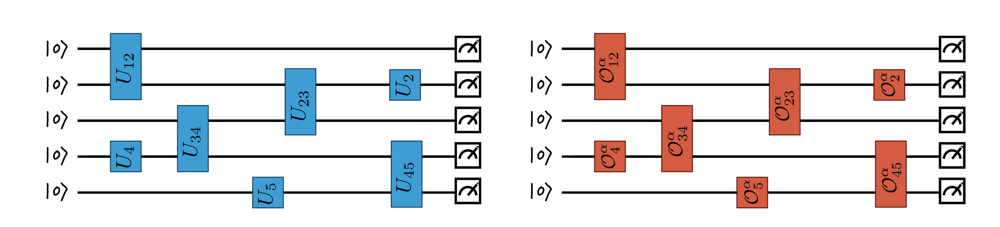

% Error mitigation for short-depth quantum circuits
% Nate Stemen
% Oct 2, 2020

# Todays Paper

# Why do we need error mitigation?

# Why do we need error mitigation?

# Aren't we done?
Well, mitigation methods can be/are _expensive_

## Focus of this paper
- Meaningful impact for current, and near term quantum computers

::: notes
quantum computers now are mostly limited by their number of qubits, and decoherence times. Theoretically, we could use the 9-qubit code to correct errors, but to factor something like a 1000 bit number requires millions of logical qubits. We're going to need some time to get there. When we have quantum computers that are running on the order of 10 qubits, adding qubits anywhere in the system for error correction isn't always possible or wanted. Focus of this paper is to look at deliberately "simple" methods for doing error mitigation without extra resources, and for computations that have decoherence time in mind (which is why the paper is about short-depth circuits/finite time computations). With this in mind, near term applications of quantum computers need to give accurate expectation values, possibly at the expense of other quantities.

In short, near term applications can be thought of as "applying a short-depth quantum circuit to some simple initial state and then estimating the expectation value of some observable".

:::

# Extrapolation to the zero noise limit

- View computation as the evolution of a Hamiltonian
- Hamiltonian $K(t) = \sum_\alpha J_\alpha(t)P_\alpha$ where $J_\alpha(t)$ are "time dependent coupling coefficients" and $P_\alpha\in \{\mathbf{1}, X_j, Y_j, Z_j\}$.
$$
\partial_t\rho(t) = -\mathrm{i}[K, \rho] + \lambda\mathcal{L}(\rho)
$$
- $\lambda\mathcal{L}(\rho)$ being the error term with $\lambda \ll 1$
  - expected to be constant in time, and independent of $J_\alpha$'s
- Ultimately we care about $E(\lambda) = \mathrm{tr}\,(A\rho_\lambda(T))$ where $T$ is the "final time".
- Expand this as a "Born series"
$$
E(\lambda) = \mathrm{tr}\,(A\rho_0(t)) + \sum_{k = 1}^na_k\lambda^k + R_{n + 1}(\lambda, \mathcal{L}, T)
$$

::: notes
Expectation value expanded in terms of lambda doesn't really help us though, because the error will still be O(lambda). 
:::

# Extrapolation to the zero noise limit
## How can we improve our expectation value?
- Ideal system is $\lambda = 0$
- If we could run the system with different error rates $\lambda_i$, $i\in\{1,2,\ldots, n\}$ then we might be able to "extrapolate to the zero noise limit"
  - Experimentalists can't just tune their noise down
  - $J_\alpha^j(t) = c_j^{-1}J_\alpha(c_j^{-1}t)$ and evolve until $T_j = c_jT$ with $c_j > 1$
  - Can show $\rho_\lambda^j(T_j) = \rho_{c_j\lambda}(T)$ where $\rho^j$ is the state that evolves with rescaled Hamiltonian.

Combine the results from each run as $\hat{E}(\lambda) = \sum_j\gamma_j E(c_j\lambda)$ where the $\gamma_j$'s must satisfy
\begin{align*}
\sum_{j = 0}^n\gamma_j = 1 & \qquad & \sum_{j = 0}^n\gamma_j c_j^k = 0
\end{align*}
Our estimates for the expectation value off by $\mathcal{O}(\lambda^{n + 1})$ if rescaling is run $n + 1$ times.

# Probabalistic error cancellation

- Back to the circuit model, let $\Omega = \{\mathcal{O}_1,\dots,\mathcal{O}_m\}$ be our noisy operations.
- $\mathbf{\alpha} = (\alpha_1, \ldots, \alpha_L)$ implements a circuit of length $L$ as $\mathcal{O}_\mathbf{\alpha} = \mathcal{O}_{\alpha_L}\cdots\mathcal{O}_{\alpha_2}\mathcal{O}_{\alpha_1}$.
$$
E_A(\mathbf{\alpha}) = \mathrm{tr}\,[A\mathcal{O}_\mathbf{\alpha}(|0\rangle\langle 0|^{\otimes n})]
$$
- If $\Gamma = \{U_1, \ldots, U_k\}$ is a set of ideal gates, then our goal is to construct
$$
U_\beta = \gamma_\beta\sum_{\alpha \in\Omega_L}P_\beta(\alpha)\sigma_\beta(\alpha)\mathcal{O}_\alpha
$$
$$
U_2 = 5\left(p_1\tilde{X}_1 - p_2\tilde{Y}_1 + p_3\tilde{Z}_1\right)
$$
where $\sigma_\beta(\alpha) = \pm 1$, $P_\beta(\alpha)$ is a probability distribution and $\gamma_\beta \geq 1$.

::: notes

curly O's must be a TPCP (Trace Preserving Completely Positive) collection of maps that form a basis, so we know we can expand the ideal gates from them.

:::

# Probabilistic error cancellation

::: notes

variance massively blows up because something to do with gamma_beta

:::

# Conclusion

Methods described here require no additional resource and work directly with physical qubits.

## Zero noise extrapolation
- need control over time evolution of system
- "hinges on the assumption of a large time-scale separation between the dominant noise and the controlled dynamics"

## Probabilistic error cancellation
- full characterization of the noisy gates

